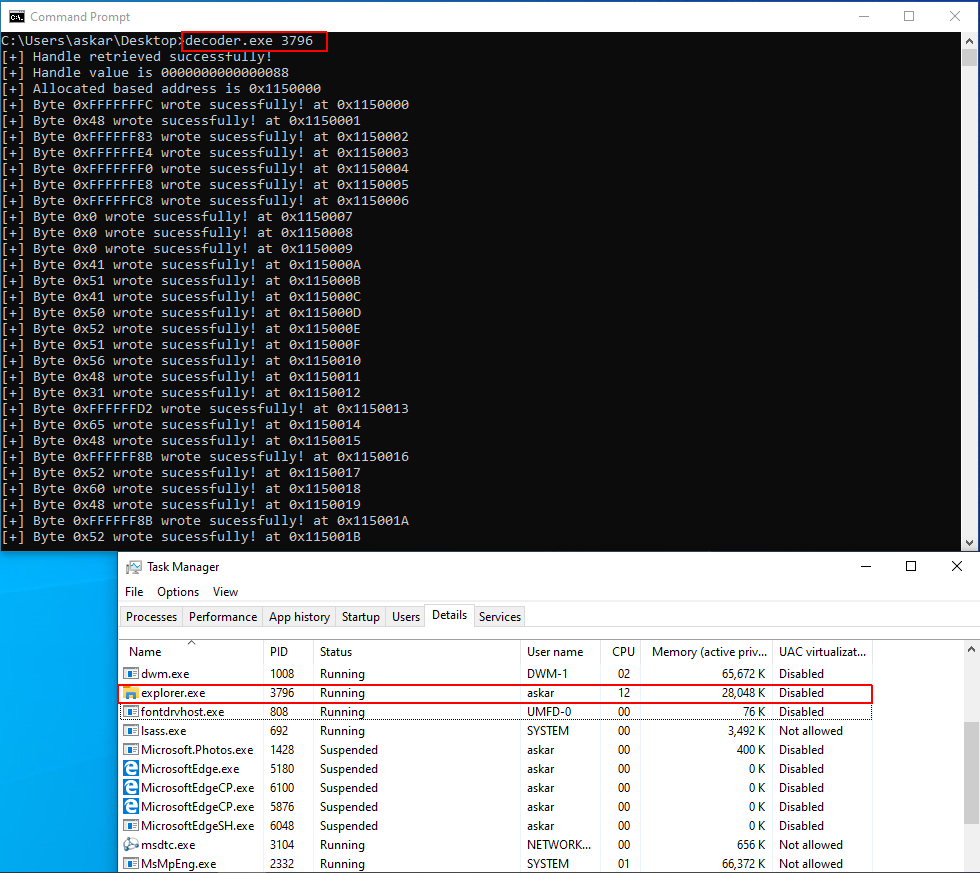
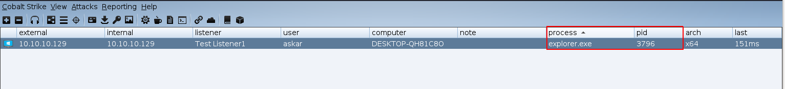

# Shellcode-In-Memory-Decoder

A simple C implementation to decoded your shellcode and writes it directly to memory.

You can use the code to perform process injection

# Usage

You need to encode your shellcode first, the file `xor-encoder.py` is a very simple example of how you can encode your shellcode using XOR.

Then you need to copy the output of `xor-encoder.py` and paste it into `shellcode` array in the file `decoder.c`.

To compile the code from Linux you can use `Mingw64` Like the following:

`x86_64-w64-mingw32-gcc decoder.c -o decoder.exe -w`

After that, you can run it in the target machine and pass the PID like the following:

`C:\Users\askar\Desktop>decoder.exe 3796`

And after we run it, we will get the following nice beacon:

